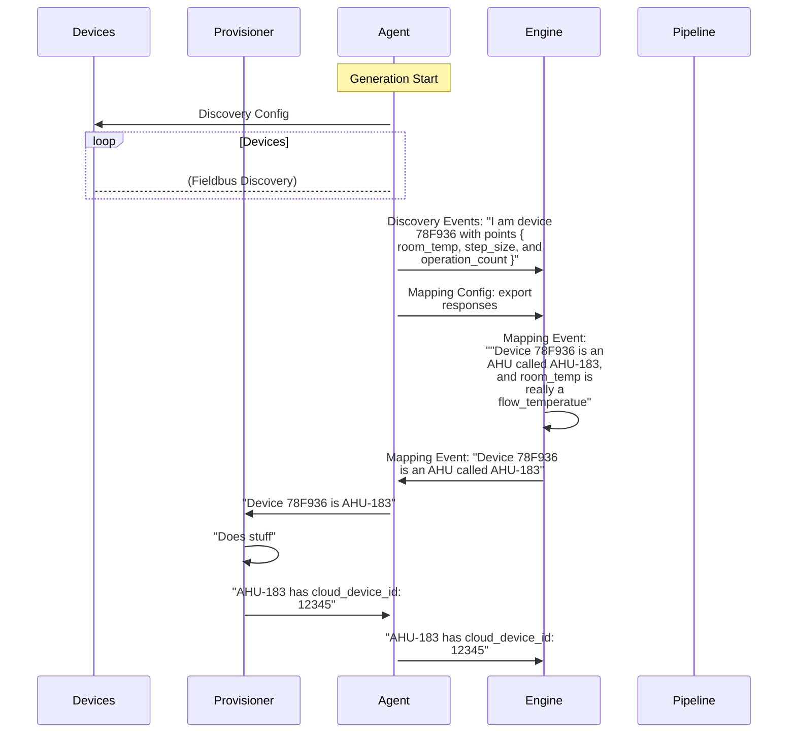

```mermaid
%%{wrap}%%
sequenceDiagram
  participant Devices 
  participant Provisioner 
  participant Agent 
  participant Engine 
  participant Pipeline
  Note over Agent: Generation Start
  activate Agent
  Agent->>Devices: Discovery Config
  loop Devices
    Agent-->Devices: (Fieldbus Discovery)
  end
  Agent->>Engine: Discovery Events: "I am device 78F936 with points { room_temp, step_size, and operation_count }"

  Agent->>Engine: Mapping Config: export responses
  Engine->>Engine: Mapping Event: ""Device 78F936 is an AHU called AHU-183, and room_temp is really a flow_temperatue"
  Engine->>Agent: Mapping Event: "Device 78F936 is an AHU called AHU-183"
  Agent->>Provisioner: "Device 78F936 is AHU-183"
  Provisioner->>Provisioner: "Does stuff"
  Provisioner->>Agent: "AHU-183 has cloud_device_id: 12345" 
  Agent->>Engine: "AHU-183 has cloud_device_id: 12345" 
```
